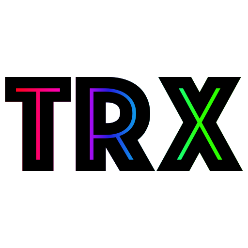

# TRX Viewer

A cross-platform desktop application for visualizing [TRX](https://github.com/tee-ar-ex/trx-spec) brain tractography files with NIfTI-1 background volumes.

Built with Rust, [egui](https://github.com/emilk/egui), and [wgpu](https://wgpu.rs/) for GPU-accelerated rendering.

<p align="center">
  
</p>

## Features

- **4-viewport layout** — 3D perspective view with axial, coronal, and sagittal slice views
- **GPU-accelerated rendering** via wgpu (Metal on macOS, Vulkan/DX12 on Linux/Windows)
- **NIfTI-1 volume slices** correctly aligned in RAS+ coordinates using the NIfTI affine
- **Depth-tested 3D rendering** for proper occlusion of streamlines and slices
- **Multiple coloring modes** — direction RGB, per-vertex (DPV) scalar, per-streamline (DPS) scalar, group color, or uniform
- **Group visibility controls** — toggle individual streamline groups on/off
- **Interactive cameras** — orbit/zoom in 3D, pan/zoom/scroll through slices in 2D
- **Crosshair overlays** on slice views showing the position of the other two slice planes
- **Intensity windowing** — adjustable center/width for volume display
- **Large dataset support** — separate position/color GPU buffers for efficient recoloring of 100k+ streamline datasets

## Usage

```bash
# Run with files as arguments
cargo run --release -- tractogram.trx background.nii.gz

# Or open files from the sidebar after launch
cargo run --release
```

## Building

Requires [Rust](https://rustup.rs/) 1.88+ and the [trx-rs](https://github.com/tee-ar-ex/trx-rs) library as a sibling directory.

```bash
# Build release binary
cargo build --release

# The binary is at target/release/trx-viewer-app
```

### macOS app bundle

```bash
cargo build --release

# The .app bundle is at target/release/TRX Viewer.app
# To rebuild after code changes:
cp target/release/trx-viewer-app "target/release/TRX Viewer.app/Contents/MacOS/TRX Viewer"
touch "target/release/TRX Viewer.app"
```

## Controls

| Viewport | Action | Input |
|----------|--------|-------|
| 3D | Orbit | Left-click drag |
| 3D | Zoom | Scroll |
| Slice | Pan | Left-click drag |
| Slice | Zoom | Right-click drag |
| Slice | Change slice | Scroll |

## Dependencies

- [trx-rs](https://github.com/tee-ar-ex/trx-rs) — TRX file reading
- [eframe](https://github.com/emilk/egui/tree/master/crates/eframe) / [egui](https://github.com/emilk/egui) — GUI framework
- [wgpu](https://wgpu.rs/) — GPU rendering
- [nifti](https://crates.io/crates/nifti) — NIfTI-1 volume loading
- [rfd](https://crates.io/crates/rfd) — Native file dialogs

## License

BSD 2-Clause
